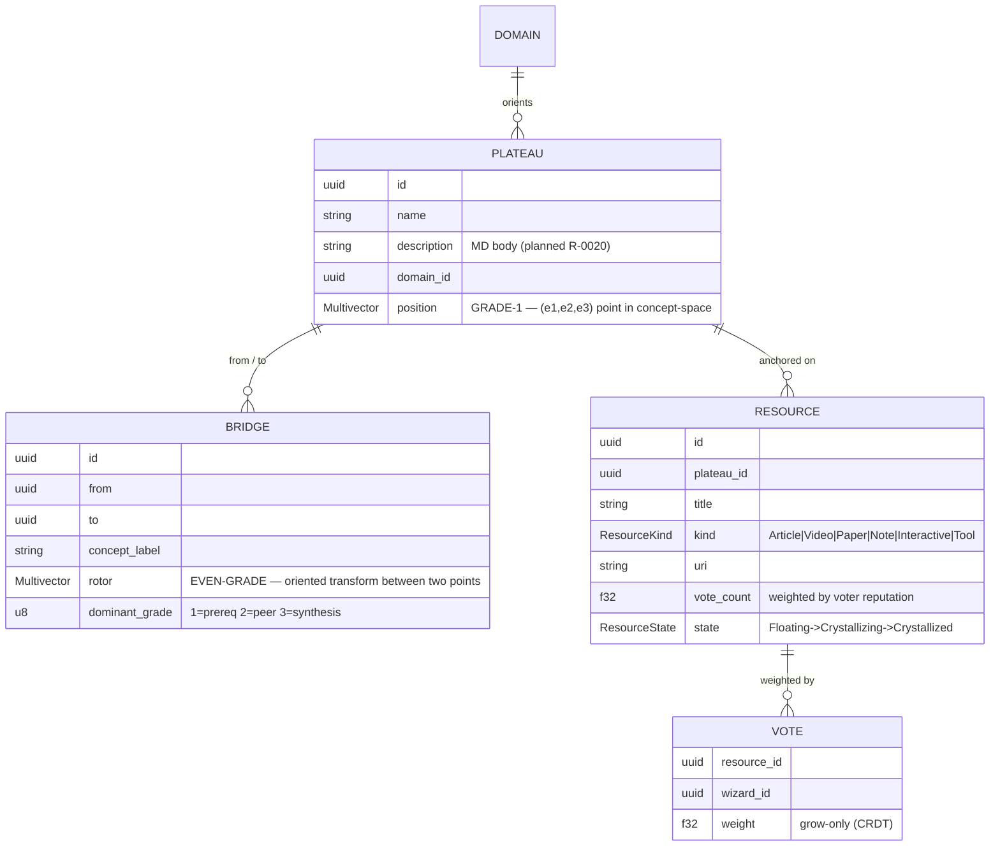
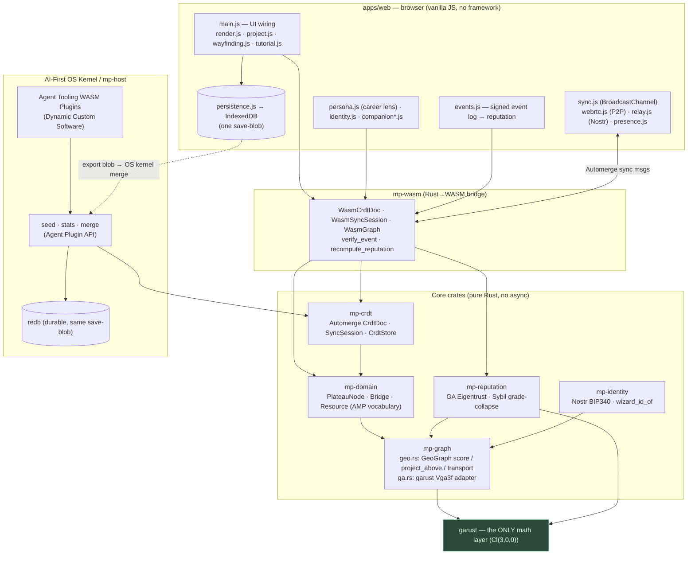
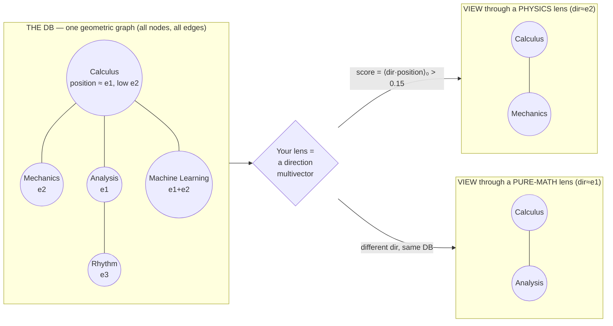

# ARCHITECTURE — as built (visual)

> Companion to `SYSTEM_ARCHITECTURE.md` (which is partly aspirational). This file
> diagrams **what actually exists today** (through R-0019) and answers two
> questions: *how is the DB shaped?* and *why is the graph you see only a view of
> it?* All diagrams are Mermaid — they render on GitHub and in most editors.

---

## 1. The data model (what the DB stores)

The authoritative store is **one geometric graph**. Everything else is derived.



**Two things are deliberately NOT in this picture:**

- **Reputation** — never stored, never synced. It is *recomputed* on each client
  from the **signed event log** (Nostr-signed traversals/vouches). Storing it
  would let someone forge rank by editing the DB; recomputing from signatures
  makes rank earned and unspoofable. (`CLAUDE.md` rule 4 & 7.)
- **The 2D/3D positions you see on screen** — those are a *projection* of each
  node's `position` multivector, computed at render time (see §3).

What syncs between peers is exactly four maps — **`{plateaus, bridges, resources, votes}`** — as an Automerge (CRDT) document. Nothing else crosses the wire.

---

## 2. How the parts interact (as-built component map)



**Reading it:** the browser never touches Rust internals — it calls `mp-wasm`,
which drives the pure core crates, which bottom out in **garust** for all
geometry. The *same* CRDT save-blob is the unit of persistence in both backings
(IndexedDB in the browser, redb natively) — "one save-blob, two backings." Three
independent transports carry the *same* sync bytes: BroadcastChannel (same-origin
tabs), WebRTC (cross-device, no server), and a Nostr relay (signed events).

> **Built today:** everything above. **Not built (in the old doc, ignore for
> now):** Godot, Three.js 3D, Gun.js, IPFS, Colyseus. The renderer today is the
> 2D canvas fog-world.

---

## 3. Why the graph you see is only a *view* of the DB

This is the key idea — and the answer to "calculus connects to everything; how
does that look in the DB?"

The DB holds **one** node for calculus, at **one** position. Its many
connections are **edges**. What changes between travelers is not the DB — it is
the **lens** (your career-lens orientation, a direction multivector) that decides
which neighbors light up.



Concretely, in `crates/mp-graph/src/geo.rs`:

```text
score(node, directions)   = max over dirs of  ⟨dir · node.position⟩₀   // Hestenes inner product, scalar part
project_above(dirs, 0.15) = every node whose score clears the fog threshold
```

So:

1. **Calculus is one row** in the `plateaus` map — a single Grade-1 multivector
   (a *point/direction* in concept-space), not "a thing connected to everything."
2. **Its hub-ness is geometric.** Because its position has a large component on a
   widely-shared axis (e.g. `e1`, the formal axis), *many* lens-directions
   project onto it above threshold. That is *why* it lights up from almost any
   orientation — it is mathematically near many lenses, not specially flagged.
3. **The path you walk is `project_above` ∘ your lens ∘ reputation**, then
   flattened to screen by `project.js` (a fixed isometric 2D projection). Two
   travelers with different lenses see *different lit subgraphs over the identical
   DB*. Calculus appears in both — embedded in a different neighborhood each time.
4. **Edges are oriented, not just present.** A bridge carries an even-grade
   *rotor*; `transport(edge, v) = R·v·~R` carries a vector *along* a connection.
   "Calculus → Mechanics through the physics lens" is a different transport than
   "Calculus → Analysis through the math lens" — same hub, different rotor.

> **So yes:** the graph/path on screen is a *particular view* of the DB —
> specifically `2D-projection( fog-filter( lens, reputation, the-one-GA-graph ) )`.
> Change the lens, the DB is untouched, but the view (and which of calculus's
> bridges glow) changes. That is the whole point of using geometric algebra
> instead of a plain property graph: "the right lens" is a literal projection.

---

## 4. Where new ideas plug in

| Idea | Where it lands in this model |
|------|------------------------------|
| **Topic info as MD + equations** | `PlateauNode.description` becomes an MD body (rendered with LaTeX client-side). Already a field in the schema; needs storage + a renderer. |
| **Embed media (YouTube/video/PDF)** | A `Resource` with `kind = Video/Paper/Interactive` and a `uri`. The kinds already exist. |
| **AI-vetted, best-upvoted resources** | `vote_count` + `ResourceState` (Floating→Crystallized) already rank by weighted votes. Add an AI pre-check gate before a resource crystallizes/shows. |
| **Import an Obsidian vault** | `.md` note → plateau (body = description); `[[wikilink]]` → bridge; `![[img]]`/`.pdf` → resource; folder/tag → domain; `.canvas` x/y → seed position. |
```
