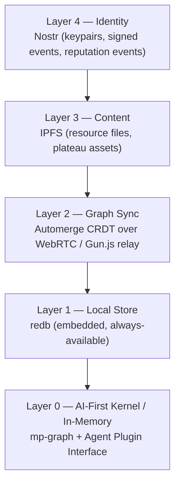

# DECENTRALIZATION — A Million Plateaus

## Principle

No single server owns the world. The platform survives any individual node going offline.

---

## Layer Stack



Reads always go **down** (fastest available layer). Writes go **up** (local first, sync later).

---

## Local-First Contract

Every operation a wizard performs works offline:
- Navigate plateaus (local graph + local reputation)
- Contribute resources (queued, signed, synced when online)
- Vote on resources (CRDT counter, merges on reconnect)
- Alebrije evolves (local state, no server needed)
- Read crystallized resources (cached IPFS content)

Only these require network:
- Discovering new plateaus not yet in local graph
- Seeing other wizard presence in real-time
- Alebrije AI responses (Claude API)
- Syncing reputation events to other peers

---

## Agent Kernel Integration (Security Cloud Native)

By leveraging an AI-First Kernel approach, decentralization no longer means just sharing data—it means sharing **secure execution**.

- **Agents as Kernel Plugins:** Agents operate directly at the kernel layer, synthesizing custom tooling locally. This avoids dependency on centralized app stores or monolithic open-source legacy systems.
- **Security Cloud Native:** The agent operations run in a sandboxed, zero-trust environment. While agents run locally (plugged into the local OS kernel), their certified outcomes sync natively across the cloud via the CRDT and Nostr event graph.
- **Personalized Software:** Each government, company, or individual effectively runs a bespoke OS tailored on the fly by their agent, fully decentralized and secure by default.

---

## Automerge CRDT — What Is Synced

```rust
// What lives in the CRDT document (shared, mergeable):
AutomergeDoc {
    plateaus:     Map<PlateauId, PlateauNode>,
    bridges:      Map<BridgeId, Bridge>,
    resources:    Map<ResourceId, Resource>,
    votes:        Map<ResourceId, Map<WizardId, Vote>>,
    trail_markers: Map<MarkerId, TrailMarker>,
}

// What is NOT in CRDT (computed locally from signed events):
// - WizardReputation (Multivector) — computed from Nostr event log
// - ResourceState (Crystallized/Floating) — computed from votes
// - Reachability (Fog) — computed from local reputation
```

**Why reputation is not in the CRDT:**
CRDT merge semantics allow any peer to write any value. If reputation were a CRDT field, a malicious peer could merge in fabricated high reputation values. Instead, reputation is computed from a **signed event log** — only events signed by the wizard's own Nostr key are accepted, and reputation is derived deterministically from those events.

---

## Nostr Integration

Nostr provides decentralized identity and a signed event feed.

```
Wizard identity = Nostr keypair (secp256k1)
  pubkey → WizardId
  privkey → signs all wizard actions

Event kinds (custom):
  Kind 30000 → PlateauTraversal  { plateau_id, depth, timestamp }
  Kind 30001 → ResourceVote      { resource_id, weight }
  Kind 30002 → BridgeProposal    { from, to, concept_label }
  Kind 30003 → AlibrijeEvolution { plateau_id, gained_component }

Reputation is computed by:
  1. Collecting all signed Kind 30000 events for a wizard
  2. Running GA Eigentrust over the event graph
  3. Result = WizardReputation (Multivector per domain)
  4. This is verified locally — no trust in server-reported reputation
```

---

## IPFS Integration

Resources are content-addressed. A resource's `uri` field is an IPFS CID, not a URL.

```
Benefits:
  - Resources survive URLs dying
  - Content is verifiable (hash = identity)
  - Popular resources are automatically replicated by interested peers
  - No central CDN

Pinning strategy:
  - Wizard's client pins resources from plateaus they've visited
  - High-reputation wizards are encouraged (not required) to pin more
  - Optional: Filecoin for long-term archival of crystallized resources
```

---

## Gun.js — Graph Relay

Gun.js provides a simple p2p graph sync relay for the Automerge CRDT bytes:

```javascript
// apps/server/src/gun-relay.ts
import Gun from 'gun'

// Acts as a relay node — does not own data
const gun = Gun({
  web: server,          // attaches to existing Express server
  peers: SEED_PEERS,    // known relay nodes for bootstrapping
})

// Clients connect to any relay — they are interchangeable
// Graph data is replicated across all connected relays
```

---

## Colyseus — Presence Only

Colyseus handles real-time multiplayer presence. It does **not** own graph data.

```
Colyseus responsibilities:
  ✅ Who is on which plateau right now
  ✅ Broadcasting PLATEAU_ENTER / PLATEAU_EXIT events
  ✅ Real-time Alebrije position sync (flight paths)
  ✅ Trail marker broadcasts
  ❌ NOT responsible for graph state
  ❌ NOT responsible for reputation
  ❌ NOT responsible for resource votes

If Colyseus goes down:
  → You lose real-time presence
  → Everything else keeps working
```

---

## Sync Conflict Resolution

| Entity | Conflict strategy |
|---|---|
| PlateauNode | Last-write-wins (plateaus rarely change after creation) |
| Bridge | Additive — bridges are never deleted, only archived |
| Resource | CRDT Map merge — votes are grow-only counters |
| TrailMarker | Last-write-wins per (wizard_id, location) key |
| WizardReputation | Not synced — recomputed locally from event log |

---

## Bootstrap Sequence (new client)

```
1. Generate Nostr keypair → WizardId established
2. Connect to any Gun relay → receive Automerge CRDT snapshot
3. Apply snapshot to local redb → graph available offline
4. Query Nostr relays for own event history → reputation computed
5. Connect to Colyseus → presence active
6. Render world → fog computed from local reputation
```

Cold start to usable world: target < 5 seconds on 10Mbps connection.
