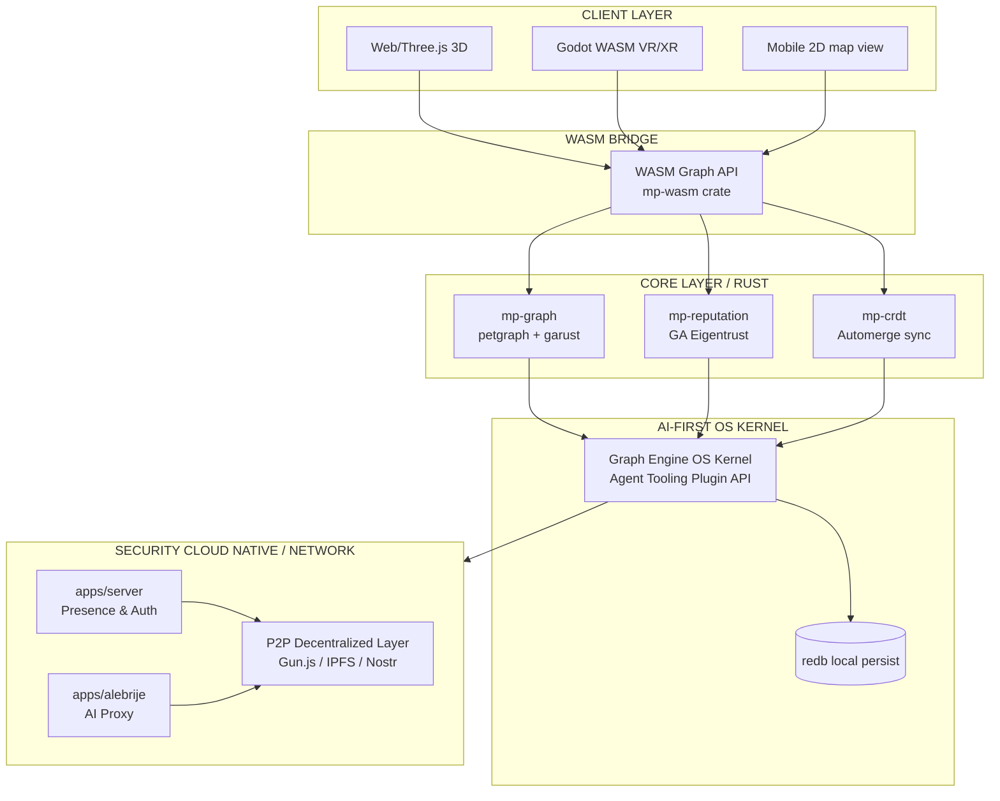

# SYSTEM ARCHITECTURE — A Million Plateaus

## Architectural Principle

> The graph is the platform. Every other component is a projection of it.



---

## Component Specifications

### mp-graph (Rust crate)

**Responsibility:** In-memory knowledge graph with GA-typed nodes and edges.

```
Dependencies:
  petgraph = "0.6"
  garust    = { path = "../garust" }
  uuid      = { version = "1", features = ["v4"] }
  serde     = { version = "1", features = ["derive"] }
  bincode   = "1"
  redb      = "1"

Exports:
  KnowledgeGraph  — main graph struct
  PlateauNode     — node type
  Bridge          — edge type (rotor-encoded)
  GraphDb         — redb persistence wrapper
```

**Key invariants:**
- PlateauNode.position is always Grade-1 (pure vector)
- Bridge.rotor is always even-grade (Grade-0 + Grade-2)
- All UUIDs are v4 random

---

### AI-First OS Kernel

**Responsibility:** Serve as the foundational operating system layer for client applications and agent tools. By conceptualizing the graph engine as an OS kernel, client apps can plug AI agents directly into it for unprecedented execution speed and customizability.

```
Design:
  - Agent Plugin Interface: Direct WASM/FFI hook into the graph engine.
  - Dynamic Tooling: Agents generate custom system utilities and software on the fly.
  - Zero-Legacy: Bypasses the need for decades of open-source framework building by having AI build custom user-land software directly on top of the graph kernel.
```

**Security Cloud Native:**
- Local execution of dynamic agent code operates in a highly constrained, verifiable WASM sandbox.
- State generated by agents is natively synchronized over the secure, decentralized network layer.

---

### mp-reputation (Rust crate)

**Responsibility:** GA-based wizard reputation computation and Sybil detection.

```
Dependencies:
  mp-graph  = { path = "../mp-graph" }
  garust    = { path = "../garust" }
  uuid      = "1"
  serde     = { version = "1", features = ["derive"] }

Exports:
  WizardReputation    — multivector reputation per domain
  ReputationEngine    — propagation, query, Sybil detection
  SybilScore          — result of grade-collapse analysis
```

---

### mp-crdt (Rust crate)

**Responsibility:** CRDT-based sync for offline-first operation.

```
Dependencies:
  automerge = "0.5"
  serde     = { version = "1", features = ["derive"] }
  tokio     = { version = "1", features = ["full"] }

Exports:
  CrdtDoc         — Automerge document wrapping graph state
  SyncSession     — peer-to-peer sync session
  ResourceVote    — grow-only counter CRDT for resource voting
```

---

### mp-wasm (Rust crate)

**Responsibility:** Expose mp-graph and mp-reputation to JavaScript via WASM.

```
Dependencies:
  wasm-bindgen      = "0.2"
  serde-wasm-bindgen = "0.6"
  mp-graph          = { path = "../mp-graph" }
  mp-reputation     = { path = "../mp-reputation" }

Build target: wasm32-unknown-unknown
```

---

### apps/server (Node.js)

**Responsibility:** Multiplayer presence, room management, wizard discovery API.

```
Stack:
  Colyseus 0.15+   — room/state server
  Express          — REST API for wizard discovery
  TypeScript       — type safety
  Gun.js           — decentralized graph relay (optional bridge to p2p)

Rooms:
  PlateauRoom      — one room per active plateau
  WildRoom         — open world traversal room

REST endpoints:
  GET /wizards/:domainId/top   — top N wizards by domain
  GET /plateaus/:id/presence   — who is on this plateau now
  POST /resources/:id/vote     — submit a vote (proxied to CRDT)
```

---

### apps/alebrije (Node.js / Edge function)

**Responsibility:** AI companion context builder and Claude API proxy.

```
Stack:
  Node.js 20+
  Anthropic SDK
  TypeScript

Flow:
  1. Client sends: { plateau_id, player_traversal_history, alebrije_state, user_message }
  2. Server builds system prompt from plateau_id (island-specific knowledge context)
  3. Server appends traversal history as player context
  4. Calls Claude API claude-sonnet-4-20250514
  5. Returns response in alebrije character voice
  6. Client never sees raw API — all context assembly is server-side

System prompt structure per island:
  "You are [AlibrijePersona], a guide made of [creature_parts].
   You are currently on the Plateau of [PlatauName], a place of [domain_description].
   The traveler has previously visited: [traversal_summary].
   You speak in short, evocative phrases. You ask more than you answer.
   You never say 'as an AI'. You ARE the world."
```

---

### apps/web (Browser)

**Responsibility:** 3D world renderer — one viewport into the graph.

```
Stack:
  Three.js r165+      — 3D rendering
  Godot 4 WASM        — primary game engine (exported to web)
  mp-wasm             — graph queries in browser
  Colyseus client     — multiplayer sync
  Gun.js client       — p2p graph sync

Scene hierarchy (Godot):
  World
  ├── PlateauManager    — spawns/despawns plateau islands
  ├── BridgeRenderer    — renders bridges between plateaus
  ├── FogController     — fog layer driven by reachability query
  ├── AlebrijeRig       — player's AI companion 3D creature
  ├── ResourceLayer     — crystallized/floating resource objects
  └── PresenceLayer     — other player silhouettes
```

---

## Data Flow: Player Moves to New Plateau

```
1. Player flies toward plateau B (currently fogged)

2. Client → mp-wasm:
   is_reachable(plateau_b_id, wizard_reputation)
   
3. mp-wasm → mp-reputation:
   inner_product(wizard_rep, plateau_b.position).scalar_part() > 0.15?
   
4a. If YES → fog lifts, Colyseus broadcasts PLATEAU_ENTER event
4b. If NO  → fog thickens, Alebrije says "Not yet. Deepen your e1 roots first."

5. On PLATEAU_ENTER:
   - PlateauRoom populated
   - Resources loaded from local CRDT store
   - Alebrije context switches to plateau B system prompt
   - Traversal history updated locally
   - Reputation update queued (depth timer starts)
```

---

## Data Flow: Resource Crystallization

```
1. Wizard contributes resource → signed with Nostr key
2. Resource added to plateau as uncrystallized (CRDT event)
3. Other wizards place vote stones → ResourceVote CRDT counter increments
4. Vote weight = voter's domain reputation scalar_part() in this domain
5. Weighted sum crosses CRYSTALLIZE_THRESHOLD → resource state changes
6. CRDT event broadcast to peers → all clients re-render resource as terrain
7. Resource's physical size in 3D world = log(vote_weighted_sum)
```
