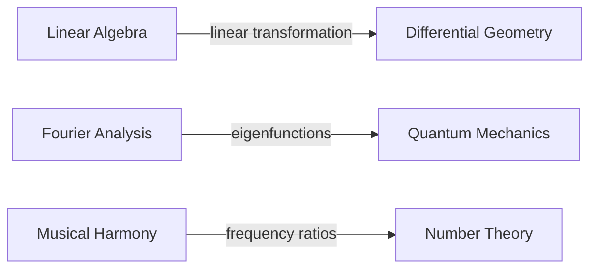

# VISION — A Million Plateaus

## Core Premise

A Million Plateaus is not a game with goals. It is a **spatial learning world** — a navigable knowledge graph rendered as an archipelago of floating islands (plateaus) connected by bridges. It is a place you inhabit, not a challenge you complete.

The name honors Deleuze & Guattari's *Mille Plateaux*: knowledge as a **rhizome** — no root, no hierarchy, no single entry point. Every plateau is equally valid as a starting point. Connections emerge laterally, not from a trunk.

We extend the metaphor by giving it the dimension the book could not: **you can fly through it**.

---

## The World

### Plateaus
Each plateau is a self-contained knowledge domain or concept. Examples:
- The Plateau of Linear Algebra
- The Plateau of Fourier Analysis
- The Plateau of Musical Harmony
- The Plateau of Projective Geometry
- The Plateau of Evolutionary Biology

Plateaus are not chapters or lessons. They are **places with atmosphere** — visual identity, ambient sound, a resident wizard community, and resources crystallized from collective contribution.

### Bridges
Bridges connect plateaus at their **conceptual intersection points**. A bridge is not just a path — it carries a concept label:

Bridges are **bidirectional but asymmetric** — crossing from A→B feels different from B→A. The bridge encodes the orientation of the relationship as a geometric (GA) rotor.

### The Fog
Plateaus you have not approached are obscured by fog. The fog lifts not by completing prerequisites linearly, but by accumulating **sufficient depth** in adjacent plateau domains. This is soft hierarchy: structurally honest, experientially free.

---

## The Alebrije Companion

Every traveler has an **Alebrije** — a psychopomp guide built from combinatorial creature components. Inspired by Mexican folk art tradition, an Alebrije is assembled from parts of multiple animals, each encoding a learning archetype:

| Creature | Archetype |
|---|---|
| Owl | Formal logic, proof |
| Octopus | Systems thinking, interconnection |
| Jaguar | Intuition, pattern recognition |
| Serpent | Recursion, self-reference |
| Eagle | Abstraction, elevation |
| Axolotl | Regeneration, resilience in confusion |

Players can **combine, customize, and evolve** their Alebrije. The Alebrije is the player's **living transcript** — it grows new features when knowledge deepens, changes color with domain, and remembers every plateau visited.

The Alebrije is also an **AI companion** powered by Claude API — context-aware of which plateau you're on, your traversal history, and your learning style. It does not lecture. It asks, it points, it waits.

---

## Wizard Rank

There are no grades, no tests, no scores.

Wizard rank is **emergent reputation** — crystallized from:
- Resources you contributed that were voted valuable by others
- Bridges you discovered and named
- Other wizards who cite your contributions
- Depth of traversal (breadth + time spent in a plateau)

Rank is **domain-scoped** — you may be a Grand Wizard of Geometric Algebra and a Novice in Music Theory simultaneously. Your rank is a multivector in domain-space, not a scalar. This is not metaphor — it is literally implemented using `garust`.

High wizards are **discoverable** — if you enter a plateau and want to learn from the best, you can find and contact the highest-ranked wizards in that domain. Mentorship emerges naturally from the architecture.

---

## Social Mechanics

### Resource Crystallization
Resources (papers, explanations, videos, interactive tools) start as **floating debris** when contributed. Community votes solidify them into permanent island terrain. The best resources literally become part of the landscape. Poor resources dissolve back into the sea.

### The Voting Mechanic is Spatial
You do not click a thumbs-up. You **place a glowing stone** on a resource. Enough stones → the resource crystallizes into the plateau's bedrock. This is not gamification — it is making the social process legible as physical geography.

### Shared Traversal
You can see other travelers as silhouettes in the fog. You can follow someone's path. You can leave **trail markers** — short personal notes anchored to a specific location in a plateau — that others can find.

---

## The AI-First OS Kernel

A Million Plateaus is evolving beyond a knowledge graph; it is the foundation of an **AI-First Operating System**. 

Instead of traditional user-land software and slow, decade-long open-source development cycles, this OS allows client apps to plug agents directly into the kernel. 

- **Custom Tooling on the Fly:** Agents dynamically generate the tooling and software the OS needs.
- **Zero Legacy:** People, companies, and governments can have custom software built instantaneously by agents, bypassing the need for legacy Linux-style package management and standard binaries.
- **Agent Kernel Integration:** By plugging an agent directly into the kernel, the execution speed and customizability of the system are drastically increased.

---

## Design Principles

1. **The graph is the platform.** The 3D world is one renderer. A terminal client, a mobile map view, and a VR headset are all valid viewports into the same underlying graph.

2. **No central server owns the world.** The knowledge graph is a CRDT that lives locally and syncs peer-to-peer. The world cannot die because a company shuts down.

3. **Wizard rank is geometry, not arithmetic.** Reputation propagates as geometric products through the GA multivector space — resistant to Sybil manipulation because scalar collusion cannot produce high-grade multivector components.

4. **The Alebrije is yours.** Your companion's state is local-first. The AI calls hit an API but your graph traversal history, your creature configuration, your trail markers — these are your data, on your machine.

5. **Learning is becoming, not achieving.** There is no completion state. The world grows as the community grows. A wizard never finishes — they deepen.
